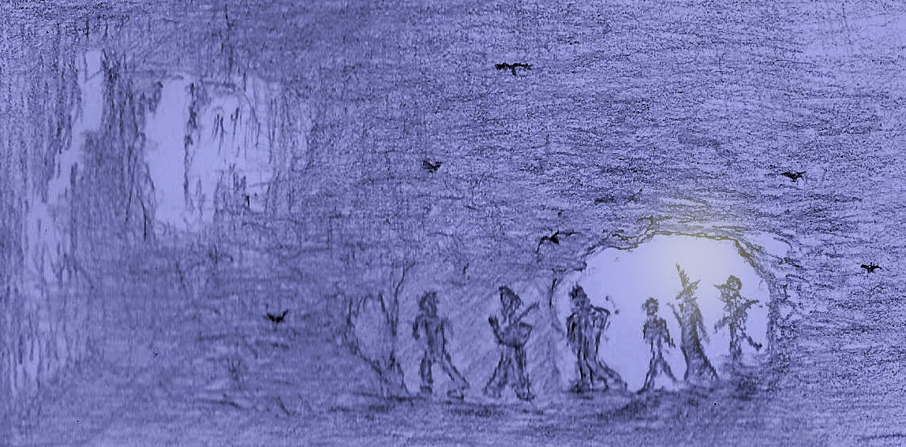
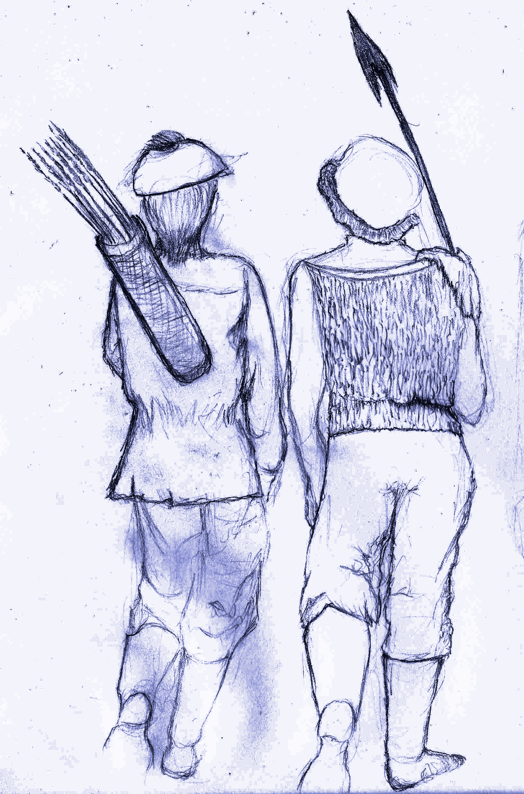
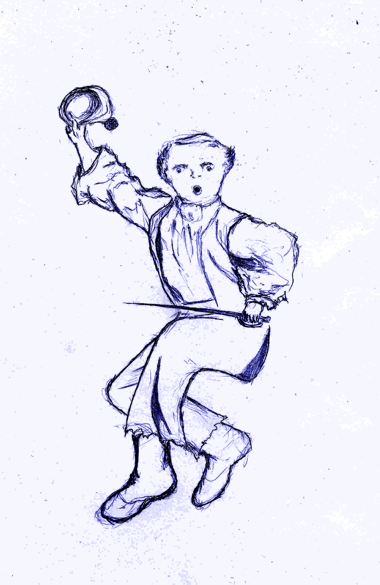
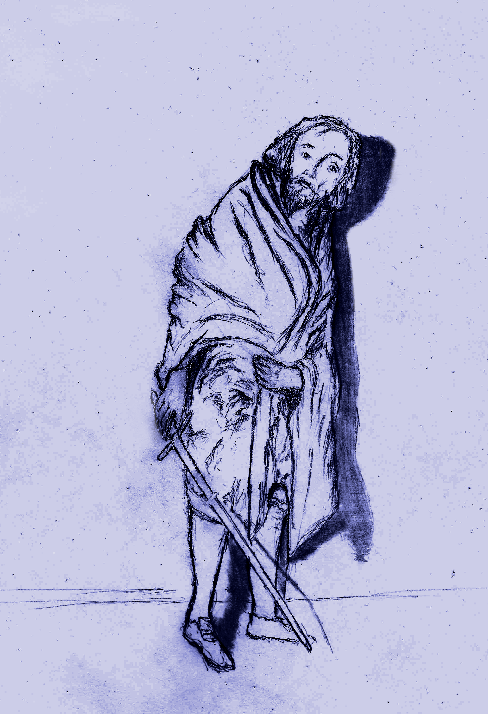
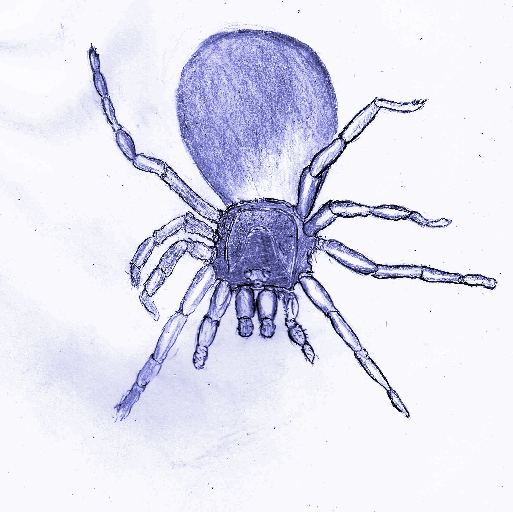
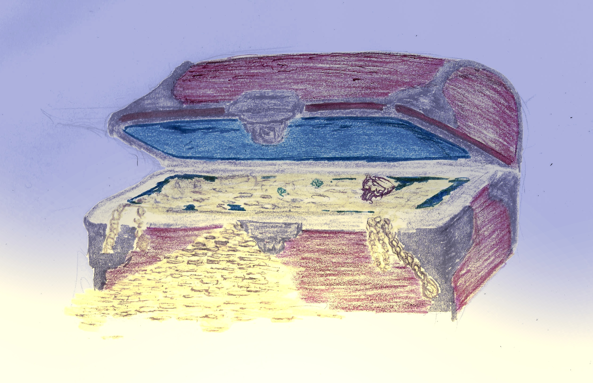

<!-- <link rel="preconnect" href="https://fonts.googleapis.com">
<link rel="preconnect" href="https://fonts.gstatic.com" crossorigin>
<link href="https://fonts.googleapis.com/css2?family=Manufacturing+Consent&family=Metamorphous&family=New+Rocker&family=Uncial+Antiqua&display=swap" rel="stylesheet">

 -->

DepthRangers RPG System Handbook
==============

***
[A BIT-Mysteries Product](https://bajainnotech.github.io/bit-mysteries/)
***

**
Authors**

*
Eduardo del Corral, Ehira A. Lira & Hyunjin Oh
*

***
Illustrations
***

Ehira A. Lira

**
v 1.1
**

Welcome to the **DepthRangers** guild, where we handle all sorts of underground exploration requests. From a lost pet, to making contact with an unknown plane of existence. This job is its own reward, though the riches found along the way provide an extra motivation.

This short book describes the **DepthRangers** system. This is a rules-light combat heavy system that focuses on fast paced gameplay. On this book you'll find the necessary resources to create your character, and some of the dangers you'll find along the way. You may excuse the succinctness of this manuscript but our staff seem to have most of their attention on the hunt of a much lauded treasure, the details of which they've kept to themselves...

<b>TABLE OF CONTENTS</b>

- [DepthRangers RPG System Handbook](#depthrangers-rpg-system-handbook)
  - [Getting Started](#getting-started)
  - [Character Creation](#character-creation)
    - [Base Stats](#base-stats)
      - [HP](#hp)
      - [Armor Class](#armor-class)
      - [Saves](#saves)
      - [Money](#money)
      - [Inventory](#inventory)
      - [Starting Gear](#starting-gear)
    - [Races](#races)
      - [Human](#human)
        - [Human Saves](#human-saves)
        - [Human Classes](#human-classes)
        - [Human Gear](#human-gear)
        - [Human Special Feature - Manifestation Of Will Power](#human-special-feature---manifestation-of-will-power)
          - [Re-Roll Dice](#re-roll-dice)
        - [Human Special Feature - Mind Over Body](#human-special-feature---mind-over-body)
        - [Human Special Feature - Human Perseverance](#human-special-feature---human-perseverance)
        - [Human Special Feature - Human Intuition](#human-special-feature---human-intuition)
        - [Human Special Feature - Inspiring Determination](#human-special-feature---inspiring-determination)
      - [Elf](#elf)
        - [Elf Saves](#elf-saves)
        - [Elf Classes](#elf-classes)
        - [Elf Gear](#elf-gear)
        - [Elf Special Feature - Resist Mental Manipulation](#elf-special-feature---resist-mental-manipulation)
        - [Elf Special Feature - Keen Senses](#elf-special-feature---keen-senses)
        - [Elf Special Feature - Keen Marksmanship](#elf-special-feature---keen-marksmanship)
      - [Dwarf](#dwarf)
        - [Dwarf Saves](#dwarf-saves)
        - [Dwarf Classes](#dwarf-classes)
        - [Dwarf Gear](#dwarf-gear)
        - [Dwarf Special Feature - Poison Immunity](#dwarf-special-feature---poison-immunity)
        - [Dwarf Special Feature - Dwarven Resilience](#dwarf-special-feature---dwarven-resilience)
        - [Dwarf Special Feature - See In The Dark](#dwarf-special-feature---see-in-the-dark)
      - [Brownie](#brownie)
        - [Brownie Saves](#brownie-saves)
        - [Brownie Classes](#brownie-classes)
        - [Brownie Gear](#brownie-gear)
        - [Brownie Special Feature - Lock Picking](#brownie-special-feature---lock-picking)
        - [Brownie Special Feature - Talk To Animals](#brownie-special-feature---talk-to-animals)
        - [Brownie Special Feature - Frail Body](#brownie-special-feature---frail-body)
        - [Brownie Special Feature - Hard To Hit](#brownie-special-feature---hard-to-hit)
        - [Brownie Special Feature - Attack At A Distance](#brownie-special-feature---attack-at-a-distance)
    - [Classes](#classes)
      - [Fighter](#fighter)
        - [Fighter Gear](#fighter-gear)
        - [Fighter Boon - Enhanced Swordsmanship](#fighter-boon---enhanced-swordsmanship)
        - [Fighter Boon - Deadlier Combat](#fighter-boon---deadlier-combat)
        - [Fighter Boon - Attack Frenzy](#fighter-boon---attack-frenzy)
        - [Fighter Boon - Battlefield Resilience](#fighter-boon---battlefield-resilience)
        - [Fighter Boon - Overwhelming Tactics](#fighter-boon---overwhelming-tactics)
      - [Mage](#mage)
        - [Mage Gear](#mage-gear)
        - [Mage Boon - Universal Scroll \& Wand Casting](#mage-boon---universal-scroll--wand-casting)
        - [Mage Boon - Magic Scholar](#mage-boon---magic-scholar)
        - [Mage Boon - Magical Attunement](#mage-boon---magical-attunement)
        - [Mage Spell List](#mage-spell-list)
      - [Healer](#healer)
        - [Healer Gear](#healer-gear)
        - [Healer Boon - Innate Use Of Magic](#healer-boon---innate-use-of-magic)
        - [Healer Boon - Party Focused Scroll \& Wand Casting](#healer-boon---party-focused-scroll--wand-casting)
        - [Healer Boon - Improved Mending](#healer-boon---improved-mending)
        - [Healer Boon - Enhanced Antibodies](#healer-boon---enhanced-antibodies)
        - [Healer Boon - Potion Mixer](#healer-boon---potion-mixer)
        - [Healer Boon - Expert Field Medic](#healer-boon---expert-field-medic)
      - [Healer Spell List](#healer-spell-list)
      - [Rogue](#rogue)
        - [Rogue Gear](#rogue-gear)
        - [Rogue Boon - Expert Explorer](#rogue-boon---expert-explorer)
        - [Rogue Boon - Sneak Attack](#rogue-boon---sneak-attack)
        - [Rogue Boon - Deadly Sniper](#rogue-boon---deadly-sniper)
        - [Rogue Boon - Magical Item Use](#rogue-boon---magical-item-use)
  - [Game Mechanics](#game-mechanics)
    - [Marketplace Wares](#marketplace-wares)
    - [Selling Gear \& Items](#selling-gear--items)
    - [Exchanging Items Between Party Members](#exchanging-items-between-party-members)
    - [Important Terminology](#important-terminology)
      - [Dungeon Level](#dungeon-level)
      - [Monster Level](#monster-level)
      - [Character Level](#character-level)
      - [Party Size](#party-size)
    - [Combat](#combat)
      - [Melee Weapons](#melee-weapons)
      - [Ranged Weapons](#ranged-weapons)
      - [Empty Handed Fighting](#empty-handed-fighting)
      - [Attacking](#attacking)
        - [Critical Attack](#critical-attack)
          - [Critical Attack Table](#critical-attack-table)
        - [Normal Attack](#normal-attack)
        - [Attack Accuracy](#attack-accuracy)
          - [Single Handed and Ranged Weapon Accuracy](#single-handed-and-ranged-weapon-accuracy)
          - [Two Handed Weapons Accuracy](#two-handed-weapons-accuracy)
      - [Retreating From An Encounter](#retreating-from-an-encounter)
    - [Hazard Dice And Non Combat Events](#hazard-dice-and-non-combat-events)
      - [Non Combat Event](#non-combat-event)
      - [Hazard Die Roll](#hazard-die-roll)
    - [Searching](#searching)
    - [Lock-picking](#lock-picking)
    - [Trap Deactivation](#trap-deactivation)
    - [Lingering Status Effects](#lingering-status-effects)
      - [Bleeding Status](#bleeding-status)
      - [Diseased Status](#diseased-status)
      - [Poisoned Status](#poisoned-status)
      - [Sprained](#sprained)
      - [Fatigue](#fatigue)
    - [Resting](#resting)
    - [Illumination](#illumination)
    - [Leveling Up](#leveling-up)
  - [Bestiary](#bestiary)
    - [Calculating Monster Stats](#calculating-monster-stats)
    - [Monsters](#monsters)
      - [Bat](#bat)
      - [Black Ooze](#black-ooze)
      - [Dragon](#dragon)
      - [Goblin](#goblin)
      - [Mimic](#mimic)
      - [Orc](#orc)
      - [Skeleton](#skeleton)
      - [Spider](#spider)
      - [Snake](#snake)
    - [Enemy Reactions](#enemy-reactions)
  - [Traps](#traps)
    - [Pit Trap](#pit-trap)
    - [Poison Darts](#poison-darts)
    - [Tongues of Flame](#tongues-of-flame)
    - [Toxic Gas](#toxic-gas)
  - [Treasure](#treasure)
    - [Treasure Contents Table](#treasure-contents-table)
      - [Weapons Table](#weapons-table)
      - [Armor Table](#armor-table)
      - [Scrolls Table](#scrolls-table)
  - [Hazard Die Roll Outcome](#hazard-die-roll-outcome)
    - [Hazard Dice Table](#hazard-dice-table)
      - [Expiration Table](#expiration-table)

## Getting Started

**DepthRangers** is a Rules-Light Open Source TableTop RPG System designed for fast paced action focused gameplay. However, its rules allow for a wide variety of adventure experiences and it has enough character creation depth for some light roleplaying. The game uses *d6* exclusively, so besides your character sheet all you need is a set of dice [or virtual dice](https://www.online-stopwatch.com/online-dice/).

While we are working hard to ensure that the game is as polished as possible, this must be considered a Work In Progress.

To play this game, you must create a series of characters using the mechanics described in [Character Creation](#character-creation), read up on the [Game Mechanics](#game-mechanics) then ask your GM to manage the [Monsters](#monsters) and assign the [Treasures](#treasure) found at the end of the book.

## Character Creation

This section provides an explanation on how to create your own characters. Following the wisdom of the late great sage *Mr. Gigax*, you will select your party by reviewing the many specialties of explorers and the particulars of the species who've decided to participate in this profession (in other words the [Races](#races) & [Classes](#classes)).

As you can imagine, all of them provide a lot of value and have many chances to shine. The key is to balance your party so that they as a whole benefit from their combined strengths.

<figure>
  

  <i>
<figcaption>Despite their competitive nature, adventurers often exchange notes and tactics.</figcaption>
</i>
</figure>

### Base Stats

These generic stats are what you use when creating different characters, some [races](#races) & [classes](#classes) will require adjusting these values.

#### HP

How resilient to damage your character is. The base HP for characters is *(2d6+3)* HP on their first level plus an additional *1d6* HP each level.

#### Armor Class

Equipping armor is vital to surviving your adventures. You subtract the damage you receive by the total amount of armor class or "*AC*" you have. Your maximum armor is determined by the armor you can equip yourself with. Though there are some restrictions on who can use certain gear (see [races](#races) & [classes](#classes)).

#### Saves

<figure>
  

  <i>
<figcaption>There are many dangers that require extraordinary maneuvers to overcome.</figcaption>
</i>
</figure>

A save is thrown when an extraordinary feat must be accomplished (such as avoiding a deadly trap).
All characters have 3 types of saves:

- **Body**: Used for resisting (fort), as well as raw physical prowess (strength).
- **Dex**: Dexterity saves are used for acrobatics, fine motor skills, sneaking and other skills that require fine control over the body or quick reaction.
- **Magic**: Magic saves are used for magical attunement when resisting or tapping into magic as well as transcendental experiences such as spiritual, will power, intellectual, etc.

*The baseline for all saves is 4.*

When asked to roll for a save a *d6* is thrown, if the value is equal to or greater than the character's save the save is successful otherwise it fails.

While saves generally require a roll of 4 or greater, some races have bonuses and penalties that will change this amount. So be sure to account for these bonuses and penalties in your character sheet.

#### Money

The currency of this game is gold, and "g" is the unit. Your character starts out with *1d6\*20*g and will gain more gold from completing quests and selling items. You'll use this to purchase items, use services and even bribe receptive monsters into giving you information.

#### Inventory

Your cargo capacity. Each character has 10 available inventory slots, so long as they don't fatigue.

#### Starting Gear

You start out with 5 torches and rations.

### Races

There are 4 races of adventurers available:

- Human
- Elf
- Dwarf
- Brownie

Each has its own strengths and weaknesses and all have something valuable to contribute.

#### Human

<figure>
  

  <i>
<figcaption>Ingenious and determined, humans can turn the tide of events at the last minute.</figcaption>
</i>
</figure>

Humans are set apart by their sheer willpower.

##### Human Saves

They have no bonuses or penalties.

##### Human Classes

They can be any class.

##### Human Gear

They are limited only by their class.

##### Human Special Feature - Manifestation Of Will Power

Human determination and sheer force of will can have a direct impact on the outcome of an adventure. It can help overcome what seem to be insurmountable odds. Human will manifests itself in the form of "*re-roll*" dice.

###### Re-Roll Dice

"*re-roll*" dice allow changing the roll of any dice, at any moment in the game, for any reason. However its influence is limited:

Expending 1 <em>re-roll</em> dice only changes the outcome of a roll of <em>1d6</em>.

For example if a save requires two dice, you can expend 1 *re-roll* dice to attempt to change either one of those two dice, but you must leave the other intact. In order to change both dice, you must expend 2 *re-roll* dice.

Humans start with a single *re-roll* dice, but gain an additional dice every two levels.

Once a *re-roll* dice dice has been expended, you can recover them in two ways:

- *resting*: recovers 1 spent *re-roll* dice.
- *leaving the dungeon*: returning to the surface recovers all spent dice.

##### Human Special Feature - Mind Over Body

Humans can expend one of their *re-roll* dice to cure any status ailment.

##### Human Special Feature - Human Perseverance

When a human character's HP goes down to 0, and they have remaining *re-roll* dice, they can expend one re-roll dice and recover *1d6* HP to keep going. They can choose to expend additional *re-roll* dice and recover additional *d6* HP during this process of recovery.

##### Human Special Feature - Human Intuition

When a human makes a save roll of 6, they have a +1 to saves of that nature until the encounter or event is over.

##### Human Special Feature - Inspiring Determination

When a human lands a [critical attack](#critical-attack), for the rest of round other characters add a +1 to *(character_level)* die they roll.

#### Elf

Dexterous and magically inclined but not as resilient as humans.

##### Elf Saves

Elves have a fragile body, hence they start with *+2HP* instead of *+3HP* and gain a *+1* penalty to their *body saves* (meaning you must roll 5 or higher to succeed on a body save). However they have unusual dexterity and magical attunement, and gain a *-1* boon on *dex saves* and  also another *-1* boon on *magic saves* (meaning rolling a 3 or higher is a successful dex or magic save).

##### Elf Classes

They can be any class.

##### Elf Gear

They are limited only by their class.

##### Elf Special Feature - Resist Mental Manipulation

This magical affinity also makes them immune to magical compulsion and mental manipulation (such as being hypnotized).

##### Elf Special Feature - Keen Senses

Elven keen senses give them an edge when detecting secrets, gaining a *+1* to searching (particularly useful when detecting secret doors).

##### Elf Special Feature - Keen Marksmanship

Elven keen senses give them an edge when wielding a ranged weapon gaining [an accuracy on par with two handed weapon wielders](#two-handed-weapons-accuracy).

#### Dwarf

Dwarfs are hardier than their peers, but not as dexterous.

##### Dwarf Saves

Their resilient body grants them a *-2* boon to body saves (meaning they rolling a 2 or greater is a successful body save), but their stubby limbs impose on them a *+1* penalty to dex (meaning you must roll 5 or higher to succeed on a *dex save*).

##### Dwarf Classes

They can be any class.

##### Dwarf Gear

They are limited only by their class.

##### Dwarf Special Feature - Poison Immunity

They are almost entirely immune to poison, there are rumors of certain beings able to poison dwarfs but those rumors are generally dismissed.

##### Dwarf Special Feature - Dwarven Resilience

Dwarfs have *+1 HP* each level.

##### Dwarf Special Feature - See In The Dark

Dwarfs don't need to use torches to see (technically a purely dwarven party would not need torches). This can have some advantages in certain unconventional situations.

#### Brownie

<figure>
  

  <i>
<figcaption>Never underestimate a brownie combatant.</figcaption>
</i>
</figure>

Brownies are shorter than dwarfs and about as slender as elves.

##### Brownie Saves

Brownies are more fragile than the other races, they take *+1* penalty on *body saves* (meaning you must roll 5 or higher to succeed on a body save), but get a *-1* boon on *dex saves* (meaning rolling a 3 or higher is a successful dex save).

##### Brownie Classes

Brownies can't be healers, however they can be any other class.

##### Brownie Gear

Brownies can't use two handed weapons, but they can use single handed weapons or ranged weapons for attack.

For armor, Fighters can use Chainmail, while other classes can only use a Brigandine; but no standard shields or helmets.

##### Brownie Special Feature - Lock Picking

Brownies are very nimble with their fingers and have a knack for locks, gaining a *+1* on [lock-picking](#lock-picking) throws.

##### Brownie Special Feature - Talk To Animals

Additionally they’re able to engage in conversation with animals. If you have a brownie on your party, whenever you meet an animal, it may react in a non-hostile manner. Note that any animal that is "[Persuadable](#enemy-reactions)" will accept rations as a bribe instead of money (though some might ask for both).

##### Brownie Special Feature - Frail Body

Their bodies are somewhat fragile starting with *+1 HP* instead of *+3HP*, and deduct a *-1 HP* from each level up.

##### Brownie Special Feature - Hard To Hit

Given their smaller stature they are very hard to actually hit by an opponent, starting with a *+1 AC* and gaining an additional *+1 AC* per level.

##### Brownie Special Feature - Attack At A Distance

Using a bow grants them an additional *1 AC* on top of ranged weapon bonuses.

### Classes

These are the areas each character specializes in.

#### Fighter

Fierce and resilient damage dealing combatants.

##### Fighter Gear

Fighters are able to equip any weapons and armors they find.

##### Fighter Boon - Enhanced Swordsmanship

When engaged in melee combat, Fighters can ignore one *d6* roll of *1* for calculating accuracy, see [attack accuracy](#attack-accuracy).

##### Fighter Boon - Deadlier Combat

When landing a successful hit, they re-roll any damage die on *1*s.

##### Fighter Boon - Attack Frenzy

Upon defeating an enemy they can strike another target that same round (two attacks on that turn).

##### Fighter Boon - Battlefield Resilience

Fighters gain an additional *+3 HP* on level 1, and an additional *+1 HP* every odd level (3, 5, etc).

##### Fighter Boon - Overwhelming Tactics

When engaged in melee combat, and landing a critical attack. If the target is a "regular sized" & "non-undead" humanoid, Fighters will overwhelm their opponent knocking them violently to the ground. The target remains stunned and inactive for one round.

#### Mage

<figure>
  

  <i>
<figcaption>Mages can help turn the tide of a battle.</figcaption>
</i>
</figure>

Mages are versatile casters capable of offensive and defensive magic. They start with two spell slots and gain an additional spell per level. As mages level up, not only do they gain more spell slots, some of the spells in their possession also become more powerful. When casting, the slot used does not matter, what matters is the Mage’s level.

While extremely versatile and powerful, Mages require preparing ahead of time. They must first assign a known spell to a slot before it can be cast. Upon resting, Mages recover all their spells and can reassign known spells to their slots.

##### Mage Gear

Mages are unable to use 2 handed weapons, and they can only equip Bringadines as armor.

##### Mage Boon - Universal Scroll & Wand Casting

Mages can use any scroll to cast a spell. However using a scroll consumes it.

Similarly, a Mage is able to use a wand if found.

##### Mage Boon - Magic Scholar

Mages can learn new spells from scrolls found in their adventures (unfortunately, the ones sold in the market are only good enough for casting not studying). They learn new spells when they bring a scroll of an unknown spell to the surface.

##### Mage Boon - Magical Attunement

Due to their mastery of magic, mages can re-roll magic save die that land on one.

##### Mage Spell List

- **Invigorate**: Increases the party's melee & ranged combat output by +*character_level* for the rest of the battle.
  - Both Mages & Healers can read a scroll with this spell.
- **Protection**: Increases the party's Armor Class by +*character_level* for the rest of the battle.
  - Both Mages & Healers can read a scroll with this spell.
- **Restore Vitality**: Target recovers *(character_level)d6* HP.
  - Both Mages & Healers can read a scroll with this spell.
- **Revive**: Resurrects a fallen character to *(1d6+character_level+1)* HP.
  - Unless the party is at a rest spot, it requires a magic save to succeed.
  - Scrolls of this spell are rare, and can only be found in special chests and sold by magical/special item vendors.
  - Both Mages & Healers can read a scroll with this spell.
- **Fireball**: Launches an exploding ball of fire damaging all monsters in the room by *((1+character_level)d6)/2+character_level*.
  - Half damage on monster save, which is a roll of *(2+character_level-monster_level)*.
  - Only Mages can read a scroll with this spell.
- **Illuminate**: Can be used instead of torches to illuminate your surroundings.
  - Lasts for *2\*(character_level)* hours.
  - Dispels upon resting.
  - Only Mages can read a scroll with this spell.
- **Invisibility**: Target is invisible for 3 rounds, meaning they get no damage from melee or ranged enemy attacks.
  - Rogues automatically perform sneak attacks when their target is susceptible.
  - Only Mages can read a scroll with this spell.
- **Stop**: Target remains immobilized for *(character_level-monster_level+1)* turns.
  - Only Mages can read a scroll with this spell.

#### Healer

Healers are casters focused on defensive magic. Healers start with two spell slots and gain an additional spell per level. As they level up, not only do they gain more spell slots, some spells also become more powerful (what matters is the Healer’s level not the specific slot used). Upon resting, Healers recover all their spell slots.

##### Healer Gear

Healers are able to use any armor they find, however they can't use 2 handed weapons.

##### Healer Boon - Innate Use Of Magic

Healers know all Healer spells from the start and can cast them from any slot at any given time.

##### Healer Boon - Party Focused Scroll & Wand Casting

Healers can use mage scrolls, however they can only use scrolls that target other party members.

##### Healer Boon - Improved Mending

Healers heal *(1+character_level)* HP each time they use a bandage, and gain a +*(character_level)/2* bonus when using an antidote to neutralize poison.

Additionally,from level 2 onwards healers heal an additional *+(character_level/2)d6* HP when using a Healing Potion.

##### Healer Boon - Enhanced Antibodies

Healers are immune to sickness and can't be afflicted by a diseased status.

##### Healer Boon - Potion Mixer

Healers can combine the positive attributes of two bottles into a single bottle, though they must roll a successful magic save each time.

##### Healer Boon - Expert Field Medic

Healers are the only ones who can freely use curative items on others in the middle of battle.

#### Healer Spell List

- **Heal party**: Heals all party members in a room *(character_level+1)d6/2* HP.
- **Aura of light**: Allows the party to see in the dark for *((character_level)/2+1)* floors, providing illumination, additionally it grants the party +*(character_level/2+1)* AC vs undead.
- **Purify**: Neutralizes poison, heals sickness and reverses expiration to a character's items.
- **See hidden**: Adds a *+2* to a search and trap disablement rolls.
- **Enhanced Alacrity**: Provides the party a *+1* to dex rolls and reduces miss die roll by one for one encounter (can be used for trap saves or other similar events).

#### Rogue

<figure>
  

  <i>
<figcaption>Rogues can help circumvent some of the deadly perils of your journey.</figcaption>
</i>
</figure>

Rogues are equally dexterous and deadly. They bring an equally valuable set of skills to weapon combat and to exploration.

##### Rogue Gear

Rogues are able to use anything they find except for plate armor.

##### Rogue Boon - Expert Explorer

Rogues get a *+1* to rolls when searching, dealing with traps and picking locks.

##### Rogue Boon - Sneak Attack

Rogues deliver devastating sneak attacks to susceptible enemies (enemies such as undead may be immune, receiving a normal attack instead). To inflict them they must first hide, by spending a turn inactive and succeeding a dex save, then they produce a *(6\*character_level)d6* damage. Basically they gain full damage die plus an additional *1d6* roll of damage.

##### Rogue Boon - Deadly Sniper

When equipped with a ranged weapon, Rogues get a *+1* to their dex save when rolling for sneak attacking.

##### Rogue Boon - Magical Item Use

Starting at level 2, Rogues are able to use scrolls or wands with a proficiency of 1/2 their *character_level*. Though to use one, they must cast a successful *magic save*.

Revive scrolls require 2 consecutive successful *magic saves* to succeed.

## Game Mechanics

The world of the **DepthRangers** is one fraught with peril, and opportunity. Some of the most important things to keep in mind are detailed below...

### Marketplace Wares

<figure>
  

  <i>
<figcaption>One of the marketplace merchants.</figcaption>
</i>
</figure>

This is a list of all the items you can find across the market's many shops. This should be more than enough for an eager explorer, though there are many things not found here which you may find beneath the surface.

- **One-handed Weapons**: From blades to clubs, these are weapons that can be wielded with one hand alone. They inflict *(character_level)d6* damage, and cost 20g
  - Single handed Melee weapons can be used while holding a shield or a torch on the other hand.
  - One-handed Weapons take up 1 inventory slot.
- **Two-handed Weapons**: Larger weapons that require both hands to use, the wielder must be someone who can withstand both the weight and size of the weapon. They inflict *(character_level)d6+(character_level)* damage, and cost 50g
  - Can't equip a two handed weapon and a shield or hold a torch at the same time.
  - Two-handed Weapons take up 2 inventory slots.
- **Ranged Weapons**: Weapons that can be used to attack at a distance, they require both hands to use and consume ammunition. They inflict *(character_level)d6* damage, and cost 30g
  - Ranged Weapons take up 1 inventory slot.
- **Arrows**: Ammunition for your ranged weapon the cost per unit is 2g
  - You can store 10 arrows per slot.
- **Rations**: Edible if not flavorful; they can be stored for a considerable amount of time and will be needed should you find a place safe enough to rest within your travels. Rations are sold for single person lasting 1 day, they cost 3g
  - Each character must consume one set of rations per rest to gain its benefits.
  - Brownies can use rations to persuade animals.
  - You can store 5 rations per slot.
  - Rations can also be used during short breaks, if the characters can find 10 minutes of peace they can optionally eat 1 provision of rations. Eating a portion of rations will recover *(character_level)* HP and remove *1* round of fatigue (recover 1 fatigued slot). Note that you can't eat two consecutive sets of rations and must venture out exploring before eating again (after all you don't want to battle heartburn while fighting monsters).
- **Torches**: They are used to see at a distance (30 ft radius), though monsters can see you as well. Torches are sold in sets of 3 and cost 5g
  - One character in your party must carry a torch instead of a shield or two handed weapon.
  - You can store 5 torches per slot.
- **Brigandine**: Light padded armor with minor steel plate reinforcements. It allows for ease of movement providing light protection. It offers +1 AC, and costs 50g
  - Light armor, can be used by all.
  - Takes up 2 inventory slots.
- **Chainmail**: Fortified armor made of interlocking metal rings, while it still offers protection and some mobility only someone with strong physical endurance can be comfortable with prolonged use. It offers +2 AC, and costs 100g
  - Fortified armor, can be used by most save Mages and non warrior brownies.
  - Takes up 2 inventory slots.
- **Platemail**: A particularly heavy armor made of metal plates. While well balanced, the wearer must be trained to use this outside an exhibition room. It offers +3 AC, and costs 200g
  - Strongest conventional armor, can be used by non brownie warriors and healers.
  - Takes up 3 inventory slots.
- **Helmet**: Head protection, while not too ornamented it sure is better than a bucket. It offers +1 AC, and costs 60g
  - Can be used by non brownies / mages.
  - Takes up 1 inventory slot.
- **Shield**: Made out of wood with iron supports. Bulky but able to take a couple of blows. It offers +1 AC, and an additional +1 AC against ranged attacks, and costs 30g
  - Can be used by non brownies / mages.
  - Takes up 1 inventory slot.
- **Spell Scroll**: Cheaply made but handy, use of scrolls saves precious spell slots. Each costs 100g
  - Spell Scrolls contain mage spells exclusively. A spell scroll can be used for casting by Mages and Healers (though healers can only use spells that target party members).
  - The spell types in those scrolls must be defined upon acquisition (before entering the dungeon).
  - Mages can't learn from these scrolls, to learn a new spell the scroll must be obtained during your travels.
  - They're fragile so you can store 3 per slot.
- **Thief’s Tools**: These are thin bits made for lock-picking and trap dismantling. They cost 3g
  - Unfortunately thieves tools can only be used once.
  - Used for door, treasure and trap picking by anyone (though Rogues get a +1).
  - You can store 5 per slot.
- **Healing Potion**: It comes in small vials, each costs 20g
  - You can store 10 potions per slot.
- **Fire Oil**: It can explode when activated causing a room (12 ft radius) to be set ablaze and harming monsters for 2d6 HP damage. Each costs 30g
  - Set all monsters in the room ablaze, and anyone can use them.
  - They're volatile so you can only store 5 per slot.
- **Sedative Gas Potion**: It seems empty but its sweet scent is a reminder of its potent effect. Each costs 100g
  - All living enemies in a normal encounter within 20ft in a non ventilated area must must roll a save of 4 or become paralyzed for 1 turn. Sleeping enemies are automatically sneak attacked by Rogues.
  - They're volatile so you can only store 5 per slot.
- **Bandages**: A large pad of absorbent cloth, attached to the middle of a strip of thin fabric dowsed in anesthetic and antiseptic oils. Each set of bandages costs 3g.
  - Recover 2 HP (healers recover more), can help with slight injuries.
  - Bandages can be used to stop bleeding.
  - You can store 15 per slot.
- **Antidote Potion**: A yellow vial containing a particularly acrid scent. Each costs 30g
  - Recovers you from poison status, though you must roll a *d6* vs *poison_level* to see if it took effect. You can store 10 per slot.
- **Medicinal Potion**: A blue vial containing an antibacterial compound. Like most medicines, it has a bitter taste, each costs 50g
  - Helps recover from sickness.
  - You can store 10 per slot.
- **Tonic**: A green vial that has a spicy scent, each costs 100g
  - Helps recover one stack of fatigue.
  - You can store 5 per slot.
- **Restore Expired Goods**: Treatment for each item costs 1g

*Every trader you find, regardless of their specialty or location, will purify expired goods for 1g (per piece) as a service to explorers.*

### Selling Gear & Items

Though most of what you buy is already second hand, it doesn't mean you are not affected by depreciation. When you sell items, you only get half the item's price. You can always sell gear at the surface, but there are actually a good deal of places to sell gear in your travels.

### Exchanging Items Between Party Members

When making your purchases, keep in mind that once outside the safety of your guild, there is less time to go rummaging through your backpacks. So each party member should be somewhat self sufficient. On one hand, adventurers can exchange items only outside of combat. And even then, since you're on the go, you can only exchange one item at a time. That means that if you wish to give your party mate 3 bottles of healing, you will give them one at a time as you keep on exploring so that you both hand over each and store them.

### Important Terminology

These concepts will be used for many aspects of the game such as monster damage. We suggest that you always *ignore fractions in any calculations you do.*

#### Dungeon Level

<figure>
  

  <i>
<figcaption>Underground adventures have varied landscapes.</figcaption>
</i>
</figure>

Level you're currently at in a dungeon  or quest (starts at 0), found in calculations as: **dungeon_level**. Again if you're not in a dungeon, then your quest itself determines what this value is.

#### Monster Level

The level of a monster (starts at 0), found in calculations as: **monster_level**

This value should be the same as the **dungeon_level**, but it's decoupled to allow GMs a bit more control.

#### Character Level

Level your playable character currently has (starts at 1), found in calculations as: **character_level**

#### Party Size

Amount of playable characters that make up your party. These monster encounters were designed with 4 in mind, so you might need to make adjustments if you deviate a lot from this amount. Found in calculations as: **party_size**

### Combat

A DepthRanger's life is not a cozy one - Life or death situations are commonplace in the depths. This section are the bits of knowledge that provide a lifeline to these brave explorers.

First, players must take the initiative. That is, when players enter combat, they generally get the upper-hand and strike first (any exception would be a particularly crafty opponent).

Second, players are warned to carry ranged weapons as well (the best weapon type is having both melee and ranged)!!!

With that out of the way, the next sections will get into detail on the particulars of aiming, tactics, etc.

#### Melee Weapons

Single and Two-Handed weapons are used by front line combatants. They have the advantage of not requiring munitions, plus certain classes have boons specifically for this type of combat.

#### Ranged Weapons

A ranged weapon generates the same level of damage as a melee weapon. Since using a ranged weapon allows the user to attack at a distance, that user is granted +*(character_level+1)* AC. When a player is using a ranged weapon, they use both hands so technically ranged weapons are a special class of two handed weapon though they only take up one slot when stored. Meaning a character wielding a ranged weapon can't hold a torch.

Unfortunately, each use consumes an arrow and you can only have 10 arrows per slot (unless you find a quiver). In addition, you may need a backup melee weapon to switch to if you run out of ammunition. Also, in order to use your ranged weapon you need to equip the ranged weapon ahead of time. Changing weapons mid battle requires spending a turn performing this task.

Finally, you can't use ranged weapons to detain someone who's trying to escape (you use your hands or the flat of the blade).

#### Empty Handed Fighting

When a character lacks a weapon, they have single handed weapon accuracy and inflict *character_level* damage.

#### Attacking 

Attack outcome is determined when damage dice are rolled, in other words there's no need for an additional roll to determine outcome.

Depending on what numbers were rolled, one of three things will happen:

- A devastating critical attack
- A normal attack
- Missing your target, [see attack accuracy](#attack-accuracy)

##### Critical Attack

Your character performs a devastating attack. Critical attacks perform serious damage, and in addition certain classes and monster types unleash a specific tactical maneuver.

###### Critical Attack Table

| **Character Level**  | **Number Of Fives/Sixes Rolled**                                                                   |
| -------------------- | -------------------------------------------------------------------------------------------------- |
| 
 1 
 | If the character rolls a 6, it performs a critical attack.                            |
| 
 2 
 | If the character rolls a single 6, it performs a critical attack.                            |
| 
 3 
 | If the character rolls a combination of one 5 or 6, and one 6 it performs a critical attack. |
| 
 4 
 | If the character rolls a combination of one 5 or 6, and one 6 it performs a critical attack. |
| 
 5 
 | If the character rolls a combination of two 5 or 6, and one 6 it performs a critical attack. |
| 
 6 
 | If the character rolls a combination of two 5 or 6, and one 6 it performs a critical attack. |

##### Normal Attack

Normal attacks simply tally the damage dice and add any bonuses (or minuses) to the total damage output.

##### Attack Accuracy

During combat, weapon accuracy is determined with the same dice throw used for damage.

###### Single Handed and Ranged Weapon Accuracy

When you roll *(character_level)/2+1* one's, that character misses. That is, it takes rolling a 1 on the first level then an additional 1 every even level up. This is laid out on the table below:

**Single Handed Weapon Accuracy Table**

| **Character Level**  | **Number Of Ones Rolled That Cause The Character To Miss An Attack**  |
| -------------------- | --------------------------------------------------------------------- |
| 
 1 
 | *1*, if the character rolls a single one, the attack misses.         |
| 
 2 
 | *1*, if the character rolls a single one, the attack misses.         |
| 
 3 
 | *2*, if the character rolls two ones, the attack misses.             |
| 
 4 
 | *2*, if the character rolls two ones, the attack misses.             |
| 
 5 
 | *3*, if the character rolls three ones, the attack misses.           |
| 
 6 
 | *3*, if the character rolls three ones, the attack misses.           |

###### Two Handed Weapons Accuracy

A two handed sword allows you to ignore one of these rolls, when you roll *(character_level)/2+2* one's, that character misses. Similar to the above, just a bit more accuracy:

**Two Handed Weapon Accuracy Table**

| **Character Level**  | **Number Of Ones Rolled That Cause The Character To Miss An Attack**  |
| -------------------- | --------------------------------------------------------------------- |
| 
 1 
 | *n/a*, the attack always succeeds.                                     |
| 
 2 
 | *2*, if the character rolls a two ones,  the attack misses.          |
| 
 3 
 | *3*, if the character rolls three ones, it misses.                   |
| 
 4 
 | *3*, if the character rolls three ones, it misses.                   |
| 
 5 
 | *4*, if the character rolls four ones, it misses.                    |
| 
 6 
 | *4*, if the character rolls four ones, it misses.                    |

#### Retreating From An Encounter

What are you a humanoid or a rat person? No retreating, you succeed or die trying!

*We actively discourage retreat*, however if you wish to include this, then all characters in the party must roll a successful dex save to run away. Upon failure, you spend a turn inactive.

### Hazard Dice And Non Combat Events

Hazard dice depict the dangerous nature of your profession, thrown after 4 non combat events.

#### Non Combat Event

Non Combat Events represent a sizable lapse of time spent out combat during your adventures. Non Combat events are:

- Revisiting a location
- Searching
- Picking a lock

Whenever a trap is sprung, a combat initiated or a hazard die is thrown, the non combat event count goes back to 0.

The point is that spending idle time is a luxury and comes at a cost. Besides, the existence of hazard die is a reminder of why you can't just rest anywhere.

#### Hazard Die Roll

Hazard Die Rolls depict events that take you by surprise when things seemed otherwise peaceful during your adventures. The players get to roll hazard die, however the resulting outcome is up to the GM to determine.

### Searching

*Searching:* Players can search for hidden mysteries such as secret doors by rolling a d6 that must be greater than:

*
(5-character_level+dungeon_level)
*

Elves and Rogues get a (cumulative) +1 to their roll when searching for secrets.

To detect a Secret Door you must perform a successful search.

The process of searching is slow and counts as a non-combat event (for the purposes of hazard dice rolls).

### Lock-picking

To pick a lock a player must throw a *1d6* and roll greater than 4. Rogues gain a +1, and Brownies also gain a +1 to lock-picking throws - these two bonuses are cumulative.

The process of picking a lock takes time and counts as a non-combat event (for the purposes of hazard dice rolls).

Also Picking a lock consumes a lock-pickers kit.

### Trap Deactivation

Unless told otherwise, traps can usually be deactivated by all characters. However, in order to deactivate a trap, they must expend one set of thieves tools currently in their possession.

To successfully disable a trap, you must throw a 1d6 and roll greater than 4. If you succeed you deactivated the trap otherwise the trap is sprung.

An attempt at trap deactivation will consume a set of thieves tools regardless of outcome. The character must have the tools in its possession (can't afford the time to borrow it from another player). Rogues get a +1 to trap deactivation.

### Lingering Status Effects

- [bleeding status](#bleeding-status)
- [diseased status](#diseased-status)
- [poisoned status](#poisoned-status)
- [sprained](#sprained)
- [fatigue](#fatigue)

#### Bleeding Status

A character has an open wound that causes it to lose *(monster_level)* HP every time a *hazard die* is thrown. Bleeding can be cured upon resting or application of a bandage.

#### Diseased Status

A diseased character grows weakened. They will roll a *d6* every time a *hazard die* is thrown: on a roll of 1 they must fatigue a slot.

Since a diseased character is weakened they will also walk slower; the party will expend 2 non combat events each time you travel to a visited location.

To cure disease, you can drink medicine (which will remove the status effect but not recover any fatigued slots) or ask the healer to purify. While characters recover upon reaching the surface, resting does not cure this status ailment.

#### Poisoned Status

If your character is poisoned, it will become weakened and walk slower; forcing the party to expend 2 non combat events each time you travel to a visited location. A poisoned character will roll a *d6* every time a hazard die is thrown, on a roll of 1 they will receive -*(poisoned_level)* damage.

**poisoned_level**: When you're poisoned, note the *monster_level* of the creature that poisoned you. This will be your: "*poisoned_level*".

If your character is poisoned for a second time, it keeps the largest *poisoned_level* value.

As an example, if you were poisoned by a *monster_level* 1 creature then poisoned again by a *monster_level* 3 creature, your *poisoned_level* will be 3; if you're poisoned by a *monster_level* 3 then again by a *monster_level* 1 creature, your *poisoned_level* will also be 3 (you are afflicted by the most potent poison).

To remove the poison, you can use an antidote, or have your healer purify your wound. If you use an antidote, you must roll vs your *poisoned_level* to make sure that the antidote is effective. Note that non-healer characters become unable to cure poisons for higher level monsters.

#### Sprained

A character with a minor injury will slow down the party, the party will expend 2 non combat events each time you travel to a visited location.

This, injury is thankfully not serious: You can either...

- use bandages for support and recover instantly, or
- you can "walk it off" and heal it after having traveled a leg of your journey (decided by GM fiat).

#### Fatigue

A round of fatigue forces you to lose one inventory slot. Fatigue is cumulative, and can only be fully restored upon rest, and partially restored (a single slot) by consuming a tonic. Players are free to choose which slot is afflicted by fatigue (so I suggest starting with the free slots).

### Resting

Nothing like taking the armor off and resting those sore limbs. Whenever you reach the surface, your characters rest by default (in story). Resting eases fatigue (all fatigued slots are recovered), fully heals HP, recovers Healer & Mage spells. Also a rest resets non combat event count to 0.

However, resting during your travels depends on finding a safe place to rest (which is not too common). Note that even if you find a place to rest, you need provisions for each member of your team. There are few places that actually offer food but generally you need your own food to benefit from resting. Anyone who does not eat, will not recover, and if they go 2 days (rest twice) without eating they fatigue 3 spaces, which doubles each day there after (we consider resting to take a day) until fed and rested (and this can't be cured by a spell).

Each character consumes a ration, but it doesn't matter who's carrying the rations. Just keep in mind that when you have a brownie in your party sharing a meal may help you make friends out of the less aggressive monsters.

Therefore, as far as normal HP and status recovery is concerned, it's primarily your healer's job and resting is a luxury that's welcome but can't be taken for granted.

### Illumination

Dwarfs don't need a source of light, however Brownies, Elves and Humans do. Torches last for approximately 2 hours. You can use torches, Aura of Light or Illuminate to make out your bearings and spot the many dangers in your travels. That said, spells are a finite and expensive resource. Any character that is not a Dwarf, will die automatically if your party runs out of light.

### Leveling Up

Characters level up after successfully completing a quest. This way, there's no XP tracking all that matters is that the quests have enough substance to merit the level increase reward.

That said, as an alternative for those who enjoy the complex process of tracking XP, you can level up after defeating 10*(character_level-1) monsters, that is monsters that are one level level lower than your (character_level). Key being, that you dismiss monsters weaker than you. Then it's up to the GM to decide how hard it is to find appropriately leveled monsters for you to defeat.

Additionally, you could consider finding a treasure equivalent to defeating a monster.

## Bestiary

These are the official **DepthRangers** guild monster records. This tome describes "most" of the beasts encountered during travels in the dungeons... There are rumors, of certain beasts that have not been charted, so keep that in mind, and consider submitting any such discoveries so they can be added to the official records.

### Calculating Monster Stats

Unlike players who start at level 1, Monsters start at level 0. However for most intents and purposes they are effectively one more level than that. Meaning their HP / damage can be calculated as one level higher.

As a general principle, their HP is related to their level:

*
Monster HP = (monster_level+1)d6
*

In order to calculate a Monster's damage, you can usually use the same Monster's HP calculation. So also as a general principle:

*
Monster Damage Formula = HP Formula
*

But, there are many exceptions, please read the monster's detailed descriptions to see if the principle laid out applies.

### Monsters

As mentioned before, there are many denizens in the depths however record keeping is not an easy task when you're in the heat of battle. Even afterwards, horror, fatigue or death seem to get in the way of proper recollection of the minutia of these dangerous beings. That said, here is a list of a few well known dwellers of the depths.

#### 
Bat

<figure>
  

  <i>
<figcaption>These vicious flying mammals are not to be underestimated.</figcaption>
</i>
</figure>

You find *(party_size+monster_level)* large blood sucking bats, each has *(1+monster_level)* HP. Bats perform a *(monster_level)+d6* damage, on any roll of *1* they use screech instead of missing. On critical hits they cause a *hemorrhaging byte*. They have an accuracy equivalent to a character using single-handed weapon [see single-handed weapon accuracy (remember to add +1 to the monster level when calculating accuracy)](#single-handed-and-ranged-weapon-accuracy).

**Hemorrhaging Byte:** The bat falls on top of the player and sinks its fangs, causing additional *monster_level* HP damage leaving an open wound behind. The character is afflicted by [bleeding](#bleeding-status).

**Screech:** Each party member must save vs body or receive *(monster_level+2)* HP damage.

Brownies can talk to bats, when persuadable pay a single ration for all bats.

#### 
Black Ooze

<figure>
  

  <i>
<figcaption>Black Oozes pose an unsurmountable challenge for ill-prepared explorers.</figcaption>
</i>
</figure>

Black Oozes come in pairs and have *(monster_level+1)d6* HP and inflict the same amount of damage. They are immune to sneak attacks, sedation and all spells, and must be attacked by ranged weapons or they will split into *2* Black Oozes. They have an accuracy equivalent to a character using single weapon [see single handed weapon accuracy (remember to add +1 to the monster level)](#single-handed-and-ranged-weapon-accuracy).

#### 
Dragon

<figure>
  

  <i>
<figcaption>Dragons are undoubtedly one of the deadliest denizens of the depths, no bardic sonet can fully encapsulate the horror of encountering one.</figcaption>
</i>
</figure>

Dragons have *(party_size+monster_level)d6* HP and are immune to sedation. Dragons use teeth, claws and tail to attack causing *(monster_level+1)d6* HP damage, on a 6 they breath fire. In addition, on any effective non-fire attack, the target must roll a body save or else become sprained [sprained](#sprained).

They have an accuracy equivalent to a character using a two handed weapon [see two handed weapon accuracy (remember to add +1 to the monster level)](#two-handed-weapons-accuracy).

**Breathe Fire:** Dragon breath causes *(monster_level+1)d6* HP damage to all players in the room. Each character must roll a dex save for half damage.

Brownies can talk to dragons, when persuadable pay *(monster_level+1)\*2* rations and *(monster_level+1)\*1000*g.

#### 
Goblin

<figure>
  

  <i>
<figcaption>You encounter a party of goblins, their malice is something you can never get used to.</figcaption>
</i>
</figure>

Goblins have *1d6* HP, but they attack in packs of *(monster_level+party_size)*. They have an accuracy equivalent to a character using single weapon [see single handed weapon accuracy (remember to add +1 to the monster level)](#single-handed-and-ranged-weapon-accuracy).

**Strength In Numbers:** Goblins inflict *1d6* damage when on their own. However when within the proximity of an another Goblin (there's more than one Goblin left) they instead inflict *(monster_level+number_of_goblins+1)+1d6* HP damage.

**Underhanded Tactics:** When there's than more than one Goblin adversary, upon landing a critical hit, another Goblin in its party is incentivized to take advantage of the distraction and attack the character with the least HP. This attack can potentially trigger an indefinite number of additional *Underhanded Tactics* attacks on consecutive critical attacks.

**Rejection Of Fairness:** When the number of goblins left is lower than your party size, a Goblin will escape on a missed attack.

Roll a reaction dice when encountering goblins, when uncertain pay *(monster_level+1)\*100*g to bribe them.

#### 
Mimic

<figure>
  

  <i>
<figcaption>Mimics are the dungeons prime opportunists, laying in wait for their next meal.</figcaption>
</i>
</figure>

Mimics hide waiting to catch unwary prey and posing as a treasure makes for a compelling lure. When confronted by a mimic the character that discovered it must roll a dex save, if failed the mimic latches onto the player and performs a barrage of successful attacks inflicting *(maximum damage)* each turn. They have an accuracy equivalent to a character using single weapon [see single handed weapon accuracy (remember to add +1 to the monster level)](#single-handed-and-ranged-weapon-accuracy).

When a mimic has already latched, the player must now roll a body save (raw strength) to escape. Mimics can only latch on to one player at a time, should the discoverer escape, then their main target is whomever is weakest. They have *2\*(monster_level+party_size/3)d6* HP.

**Opportune Getaway**: Should they kill an adventurer, they will escape with the body making it impossible to revive the fallen character.

**Self Preservation**: When a mimic's life is reduced to *(dungeon_level+1)* HP it will immediately escape.

#### 
Orc

<figure>
  

  <i>
<figcaption>Orc Hunters appear before you. Their ferocity is unquestionable.</figcaption>
</i>
</figure>

Orcs attack in small hunting parties of size *(party_size)/2+1*, and have *(monster_level+1)d6* HP inflicting the same amount of damage. They have an accuracy equivalent to a character using a two handed weapon [see two handed weapon accuracy (remember to add +1 to the monster level)](#two-handed-weapons-accuracy).

**Bloodlust:** Upon performing a critical attack, the target must perform a body save or suffer from [bleeding](#bleeding-status). Additionally, the thrill will propel an Orc to perform a second attack against the same or another target. Each attack has a chance at activating an indefinitely long chain of bloodlust attacks.

**Payback:** Upon receiving a critical attack, the enraged Orc will strike the opponent back, potentially triggering bloodlust when landing a critical attack to the attacker.

**Last Stand:** When an Orc only has *(monster_level+1)* HP left or is the last Orc left alive, it can crit on attacks that use 4s as well as 5s and 6s.

Roll a reaction dice when encountering orcs, when persuadable pay *(monster_level+1)* rations plus *(monster_level+1)\*100g*.

#### 
Skeleton

<figure>
  

  <i>
<figcaption>The clicking of bones seems to have an unnerving regularity as the skeletons march in your direction.</figcaption>
</i>
</figure>

Skeletons are undead monsters that come in *(party_size)* quantities, and have *(monster_level+1)d6* HP and inflict the same damage. Skeletons are immune to ranged weapons (though they sound musical when struck), sedation and sneak attacks. They have an accuracy equivalent to a character using single weapon [see single handed weapon accuracy (remember to add +1 to the monster level)](#single-handed-and-ranged-weapon-accuracy).

**Reanimate:** When a skeleton is defeated, it must be attacked again the next round or it will recover half its HP total. If not completely destroyed, they can reanimate an indefinite amount of times.

#### 
Spider

<figure>
  

  <i>
<figcaption>A venomous spider dangles from the ceiling landing right in front of you, then another to the side, then more. These spiders have you surrounded!</figcaption>
</i>
</figure>

You are attacked by *(party_size+monster_level+2)* spiders, they have *(monster_level+1)* HP and inflict the same damage. Spiders are venomous, when attacked make a successful Body save or you will be poisoned, [see poisoned status](#poisoned-status). They have an accuracy equivalent to a character using single weapon [see single handed weapon accuracy (remember to add +1 to the monster level)](#single-handed-and-ranged-weapon-accuracy).

Brownies can talk to spiders, when persuadable pay a single ration for all spiders.

#### 
Snake

<figure>
  

  <i>
<figcaption>The mesmerizing patterns on the contour of the massive snake before you challenge your hold on reality.</figcaption>
</i>
</figure>

You are attacked by a large snake. It has *(party_size+monster_level+1)d6* HP, and inflicts *(monster_level+1)d6* damage. These slithering reptiles are not venomous, yet they are still quite lethal.

When a snake performs a [critical attack](#critical-attack), the target must make a successful magic save or it will become *hypnotized* for *(monster_level+1)* rounds. If the attack is not critical but is any combination of *5s* and *6s* it will perform a *whiplash attack* instead.

Snakes have an accuracy equivalent to a character using single-handed weapon [see single handed weapon accuracy (remember to add +1 to the monster level)](#single-handed-and-ranged-weapon-accuracy).

**Hypnotized:** When a target is hypnotized by a snake, the target will become motionless (unable to attack, defend or assist in any way). A successful Magic save ends this condition early. If the target successfully saves vs hypnotism the angered snake still delivers [critical attack](#critical-attack) damage. Otherwise, the target is unharmed that round.

**Whiplash Attack:** The snake coils itself then unleashes a punishing blow, the target must perform a successful body save or will be [sprained](#sprained).

Brownies can talk to snakes, when persuadable pay *(monster_level+1)\*2* rations.

### Enemy Reactions

Monsters  may react in a non-hostile manner (or not); some monsters will only react if there's a Brownie in the party. Throwing a reaction die provides 3 outcomes:

| **Roll** | **Reaction**  | **Description**                                            |
| -------- | ------------- | ---------------------------------------------------------- |
|   1-2    |  *Hostile*    | You engage in combat                                       |
|   3-4    | *Persuadable* | Pay *(monster_level+1)d6* gold and be left alone, pay twice that amount and gain clues if that is a quest event for you. If  you don't have the money to be left alone they will engage and attack first. |
|   5-6    |   *Friendly*  | Monsters can offer clues if that is a quest event for you. |

## Traps

You'll find many perilous traps underground:

### Pit Trap

A pit opens below you, roll a dex save to avoid the trap or receive (dungeon_level)+d6 damage also your character is [sprained](#sprained).

### Poison Darts

Poison darts shoot out of the walls, roll a dex save or be [poisoned](#poisoned-status).

### Tongues of Flame

You hear a click and tongues of flames shoot out in your direction, roll a dex save or receive (dungeon_level+1)d6 damage and loose one of your torches.

### Toxic Gas

Noxious gas floods the room, roll a body save or take (dungeon_level+1) damage and become [diseased](#diseased-status).

## Treasure

<figure>
  

  <i>
<figcaption>There are riches beyond dreams below the surface.</figcaption>
</i>
</figure>

You may find treasure on your travels, in which case, roll the contents table to find out what's inside:

### Treasure Contents Table

Roll a d6 to discover the treasure's contents:

|       **Roll**       | **Contents**       | **Description**                                                                    |
| -------------------- | ------------------ | ---------------------------------------------------------------------------------- |
| 
 1 
 |  *Rations*         | There are *3\*(1+dungeon_level)* of them; however you must roll a d6 equal to or greater to the dungeon_level where they were found or these are spoiled and must be purified before consuming. |
| 
 2 
 |  *Adventure gear*  | 2x torches, one set of thieves tools and 2x fire oil and *(1+dungeon_level)\*d6* g.|
| 
 3 
 |  *Gold*            | You discover *10\*((1+dungeon_level)d6)* g.                                          |
| 
 4 
 |  *Weapon*          | You found a weapon, [see weapons table](#weapons-table).                           |
| 
 5 
 |  *Armor*           | You found a piece of armor, [see armor table](#armor-table).                       |
| 
 6 
 |  *Spell scroll*    | You found a magic scroll, [see scroll table](#scrolls-table).                      |

#### Weapons Table

Roll a d6 to see which weapon you found inside the treasure:

|       **Roll**       | **Contents**                     |                                 **Description**                                              |
| -------------------- |  --------------------------------| -------------------------------------------------------------------------------------------- |
| 
 1 
 |  *Arrows*                        | You find *(1+dungeon_level)* arrows and *10\*(dungeon_level+1)* g.                                             |
| 
 2 
 |  *Bow and Arrows*                | You find 10 arrows and a +*(dungeon_level)/2* bow, worth *50\*(dungeon_level+1)* g.                            |
| 
 3 
 |  *Quiver*                          | You find a quiver that allows you to carry 30 arrows worth *100*g and *100\*(dungeon_level)* g.                |
| 
 4 
 |  *One Handed Weapon*             | You find a +(dungeon_level)/2 One Handed Weapon worth *100\*(dungeon_level+1)* g.                            |
| 
 5 
 |  *Two Handed Weapon*             | You find a +(dungeon_level)/2 Two Handed Weapon worth *150\*(dungeon_level+1)* g.                            |
| 
 6 
 |  *Two Handed Weapon and Gold*    | You find a +(dungeon_level)/2 Two Handed Weapon worth *150\*(dungeon_level+1)*g and *250\*(dungeon_level+1)* g. |

#### Armor Table

Roll a d6 to see which piece or armor you found inside the treasure:

|       **Roll**       | **Contents**   |                                           **Description**                                                 |
| -------------------- | -------------- | --------------------------------------------------------------------------------------------------------- |
| 
 1 
 |  *Shield*      | You find a +*(dungeon_level+1)/2* Shield, worth *30\*(dungeon_level+1)* g.                                    |
| 
 2 
 |  *Helmet*      | You find a +*(dungeon_level+1)/2* Helmet, worth *60\*(dungeon_level+1)* g.                                  |
| 
 3 
 |  *Bringandine* | You find a +*(dungeon_level+1)/2* Brigandine, worth *50\*(dungeon_level)* g.                                |
| 
 4 
 |  *Chainmail*   | You find a +*(dungeon_level+1)/2* Chainmail, worth *100\*(dungeon_level+1)* g.                              |
| 
 5 
 |  *Platemail*   | You find a +*(dungeon_level+1)/2* Platemail, worth *200\*(dungeon_level+1)* g.                              |
| 
 6 
 |  *Pendant*     | You find a +*(dungeon_level+1)/2* Pendant, worth *150\*(dungeon_level+1)* g and *250\*(dungeon_level+1)* g. |

#### Scrolls Table

Roll a d6 to see which magic scroll you found inside the treasure:

|       **Roll**       |  **Contents**   |
| -------------------- | --------------- |
| 
 1 
 | *Illuminate*    |
| 
 2 
 | *Invisibility*  |
| 
 3 
 | *Protection*    |
| 
 4 
 | *Invigorate*    |
| 
 5 
 | *Stop*          |
| 
 6 
 | *Fireball*      |

*Each of these scrolls can be consumed or learned upon reaching the surface.*

## Hazard Die Roll Outcome

The outcome of the Hazard roll is entirely up to the GM, what is provided here is a helpful reference.

### Hazard Dice Table

This is a tentative set of potential outcomes of rolling a hazard dice. Players may perform the roll, but it's up to the GM to determine what happens...

|       **Roll**       |                **Hazard**                |
| -------------------- | ---------------------------------------- |
| 
 1 
 | Special Encounter (up to the GM)         |
| 
 2 
 | Encounter (normal monster encounters)    |
| 
 3 
 | [Trap](#traps)                           |
| 
 4 
 | [Fatigue](#fatigue)                      |
| 
 5 
 | [Expiration](#expiration-table)          |
| 
 6 
 | No event                                 |

#### Expiration Table

An item in the character's possession expired, roll expiration table below to find out which:

|       **Roll**       |  **Item Expired**   |
| -------------------- | ------------------- |
| 
 1 
 | Rations             |
| 
 2 
 | Torch               |
| 
 3 
 | Cure Potion         |
| 
 4 
 | Antidote Potion     |
| 
 5 
 | Medicinal Potion    |
| 
 6 
 | Bandage set         |

If the character doesn't own that item, then ignore the expiration. Otherwise, request that this item is moved to another slot to attempt to purify it later. Refusing causes other items in that slot to expire, though the player can choose to discard it instead. Torches are an exception, an expired torch is discarded automatically.
